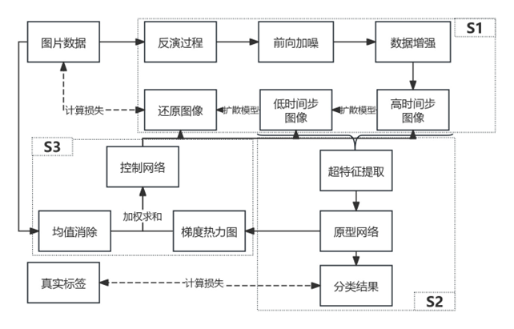
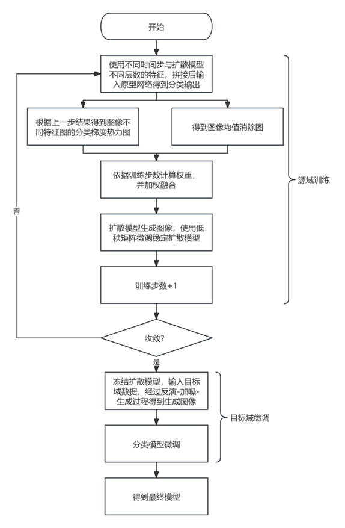

# CurSd

This repository provides the implementation of the patent:  **“Cross-Domain Few-Shot Industrial Defect Classification Based on a Progressive Conditional Diffusion Model.”**

  
    
     
  
  &nbsp;&nbsp;&nbsp;&nbsp;&nbsp;&nbsp; <!-- Control spacing between the two images -->
  
    
     
  

## Highlights

1. **Unified diffusion framework** — integrates domain adaptation, feature extraction, and image generation within a single architecture.  
2. **Hyperfeature extraction** — enhances the robustness and generalization capability of learned representations.  
3. **Progressive curriculum control** — progressively fuses strongly and weakly supervised images to improve reconstruction quality.  
4. **Few-shot domain adaptation** — achieved through stable diffusion–based domain transfer.

## Training
To train the network on a custom dataset containing images and their labeles, use the training script provided below.  
Modify `configs/train.yaml` to specify your dataset path, and then run `main.py` to start training.  
The code includes dataset configurations for **NEU**, **NEU64**, **Severstal**, and **X_SDD** datasets.

## Usage

### Stable Diffusion
- Uses [**Stable-Diffusion-v1-5**](https://huggingface.co/g-luo/diffusion-hyperfeatures/resolve/main/weights/aggregation_network.pt?download=true) as the base diffusion model.  
- Incorporates [**lllyasviel/sd-controlnet-depth**](https://huggingface.co/lllyasviel/sd-controlnet-depth) as the ControlNet module.

### Training Datasets
- **NEU Dataset** → http://faculty.neu.edu.cn/songkechen/zh_CN/zhym/263269/list/index.htm  
- **Severstal Dataset** → https://github.com/Severstal-AI/DefectNet

## References

- [Diffusion Hyperfeatures: Searching Through Time and Space for Semantic Correspondence](https://diffusion-hyperfeatures.github.io/)  
- [Unsupervised Domain Adaptation via Domain-Adaptive Diffusion](https://ieeexplore.ieee.org/document/10599225)  
- [DiffDD: A Surface Defect Detection Framework with Diffusion Probabilistic Model](https://www.sciencedirect.com/science/article/pii/S1474034624002854)  
- [Denoising Diffusion Implicit Models](https://openreview.net/forum?id=St1giarCHLP)  
- [High-Resolution Image Synthesis with Latent Diffusion Models](https://arxiv.org/abs/2112.10752)
- [clip-interrogator](https://github.com/pharmapsychotic/clip-interrogator-ext)
- [Prompt-to-Prompt Image Editing with Cross Attention Control](https://arxiv.org/abs/2208.01626)
- [Fine-tuning script for Stable Diffusion for text2image with support for LoRA](https://github.com/huggingface/diffusers/blob/main/examples/text_to_image/train_text_to_image_lora.py)
